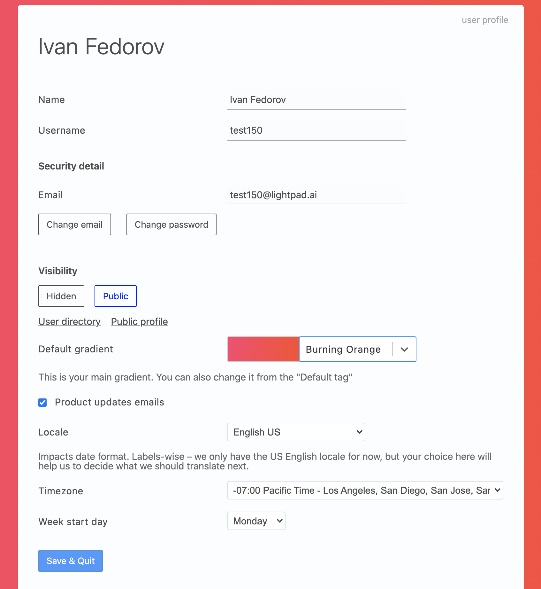

# Space UI
A collection of styled cljs/cljc components and inputs.

These components are used in [Lightpad's](https://lightpad.ai) UI system.

## License
MIT

## Artistic components license

Components listed below are under
Attribution 4.0 International (CC BY 4.0).

I ask for attribution if you use one of the artistic components below:
  - space_ui/glitch_logo.cljc
  - space_ui/perspective_oscillator.cljc
  - space_ui/isometric_preloader.cljc
  - space_ui/pulsating_frames.cljc
  - space_ui/pulsating_frames_2.cljc

[More info](https://creativecommons.org/licenses/by/4.0/)
